# Employee Management System Spring Boot application using Maven and deployed it to Kubernetes using Argo CD!
     
# Detailed Step-by-Step Process

## Table of Contents

1. [Launch EC2 Instance with t2.large and Ubuntu using a Keypair](#launch-ec2-instance-with-t2large-and-ubuntu-and-a-keypair)
2. [Install Java and Jenkins on EC2 Instance](#install-java-and-jenkins-on-ec2-instance)
3. [Install SonarQube on EC2 Instance](#install-sonarqube-on-ec2-instance)
4. [Configure Jenkins for SonarQube Integration](#configure-jenkins-for-sonarqube-integration)
5. [Install Docker on EC2 Instance](#install-docker-on-ec2-instance)
6. [Install Argo CD on Kubernetes](#install-argo-cd-on-kubernetes)
---

## Launch EC2 Instance with t2.large and Ubuntu using a Keypair

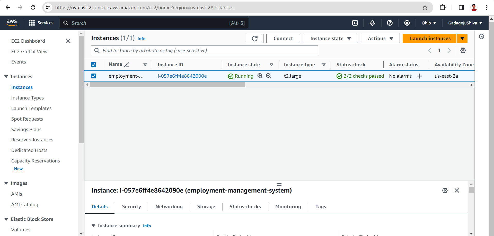

**SSH To the EC2 instance:**

```bash
ssh -i <keypair.pem> ubuntu@<ec2ip>
```
## Install Java and Jenkins on EC2 Instance

### Step 1: Update package list and install Java 11

```bash
sudo apt update
sudo apt install openjdk-11-jre
```
### Step 2: Verify Java installation

```bash
java -version
```
### Step 3: Install Jenkins

```bash
curl -fsSL https://pkg.jenkins.io/debian/jenkins.io-2023.key | sudo tee /usr/share/keyrings/jenkins-keyring.asc > /dev/null
echo deb [signed-by=/usr/share/keyrings/jenkins-keyring.asc] https://pkg.jenkins.io/debian binary/ | sudo tee /etc/apt/sources.list.d/jenkins.list > /dev/null
sudo apt-get update
sudo apt-get install jenkins
```
### Step 4: Copy the Jenkins key generated during installation and paste it into Jenkins
**The initial admin password for Jenkins is stored in:**

```bash
sudo cat /var/lib/jenkins/secrets/initialAdminPassword
```
### Step 5: Switch to the root user

```bash
sudo su -
```
## install-sonarqube-on-ec2-instance
### Step 6: Add a user named "sonarqube" and switch to that user

```bash
adduser sonarqube
sudo su - sonarqube
```

### Step 7: Install SonarQube and generate a token

```bash
apt install unzip
wget https://binaries.sonarsource.com/Distribution/sonarqube/sonarqube-9.4.0.54424.zip
unzip *
chmod -R 755 /home/sonarqube/sonarqube-9.4.0.54424
chown -R sonarqube:sonarqube /home/sonarqube/sonarqube-9.4.0.54424
cd sonarqube-9.4.0.54424/bin/linux-x86-64/
./sonar.sh start
```
**Access SonarQube in the browser and generate a token**
```bash
password = admin
username = admin
```
## Configure-jenkins-for-sonarqube-integration
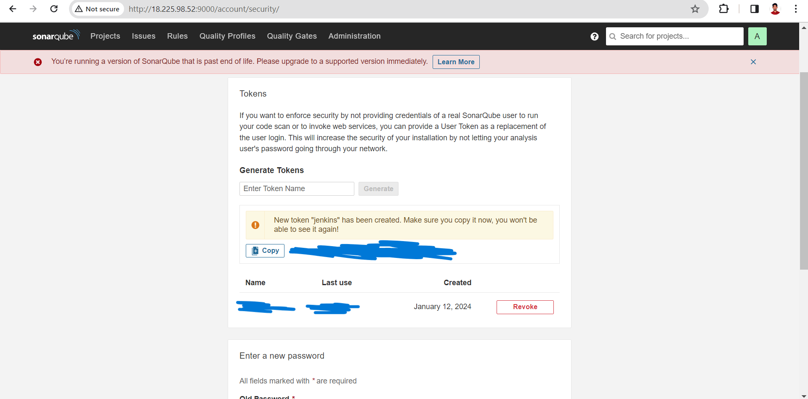
### Step 8: Generate a GitHub token and add it to Jenkins

<li>To Generate a GitHub token, go to GitHub settings → developers settings → tokens → generate classic token


<li>To add GitHub token in Jenkins, go to Jenkins → manage Jenkins → credentials → global → add credentials

### Step 9: Install required plugins in Jenkins: Docker Pipeline, SonarQube Scanner

<li>Go to manage Jenkins → plugins → available plugins → search for Docker Pipeline and SonarQube plugins and install them

### Step 10: Add Git and Docker credentials in Jenkins
<li>To add Git and Docker in Jenkins credentials, go to Jenkins → manage Jenkins → credentials → global → add credentials
     
## install-docker-on-ec2-instance

### Step 11: Install Docker on the EC2 instance
```bash
sudo apt update
sudo apt install docker.io
```

### Step 12: Grant Jenkins and Ubuntu users permissions to Docker daemon
```bash
sudo su -
usermod -aG docker jenkins
usermod -aG docker ubuntu
systemctl restart docker
```
### Step 13: Launch the Minikube cluster in your local system, not in EC2

```bash
For Windows:
    minikube start --memory=3000 --driver=hyperv
For macOS:
    minikube start --memory=3000 --driver=hyperkit
```

## Install - Argo - Cd - On - Kubernetes
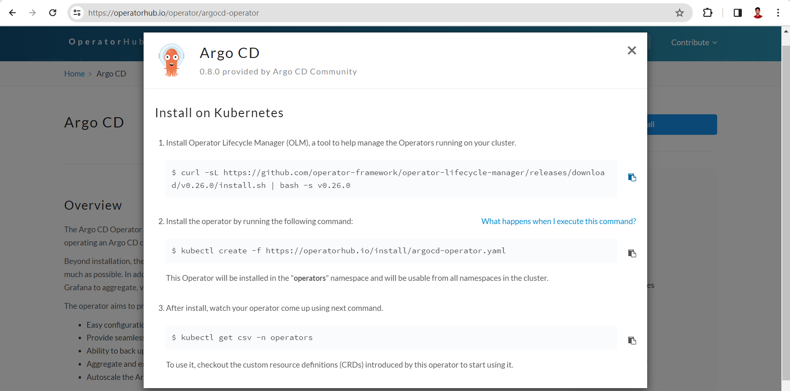
### Step 1: Install Operator Lifecycle Manager (OLM)
```bash
curl -sL https://github.com/operator-framework/operator-lifecycle-manager/releases/download/v0.26.0/install.sh | bash -s v0.26.0
```
### Step 2: Install Argo CD Operator
```bash
kubectl create -f https://operatorhub.io/install/argocd-operator.yaml
```
### Step 3: Create Argo CD cluster manifest (argocd-cluster.yaml)
```yml
apiVersion: argoproj.io/v1alpha1
kind: ArgoCD
metadata:
  name: example-argocd
  labels:
    example: basic
spec: {}
```
### Step 4: Apply the manifest

```bash
kubectl apply -f argocd-cluster.yaml
```
### Step 5: Get the Argo CD service and change it from ClusterIP to NodePort

```bash
kubectl get svc
kubectl edit svc <argocd-service-name>
# Change type: ClusterIP to type: NodePort
```
### Step 6: To get the admin password

```bash
kubectl get secrets
kubectl get secret <argocd-secret-name> -o=jsonpath='{.data.admin\.password}' | base64 -d
```

### Step 7: Access Argo CD web UI using the NodePort and login with admin credentials
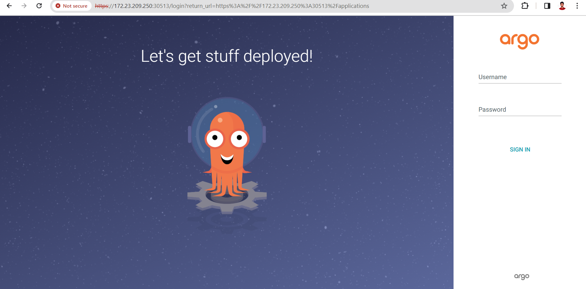

## Final Steps:
<li>Now create a new item in Jenkins using a pipeline

<li>Change the Jenkins pipeline script
<li>Add the SonarQube URL to the Jenkins script
<li>Also, check that the credentials name in Jenkins should <li>match the credentials in the Jenkins script
<li>Build the pipeline
<li>Even if you get errors, it's totally fine; check the logs and solve the issues using ChatGPT or Google to help.

**Pipeline:**
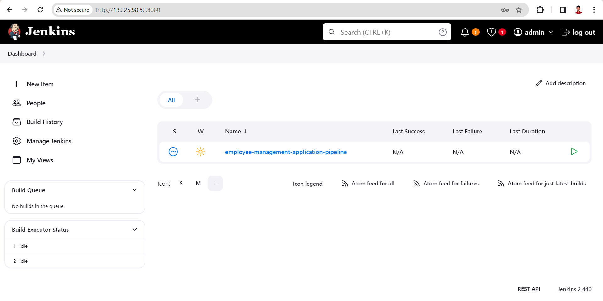

**Build sucessfully:**

**Check Docker Hub:**
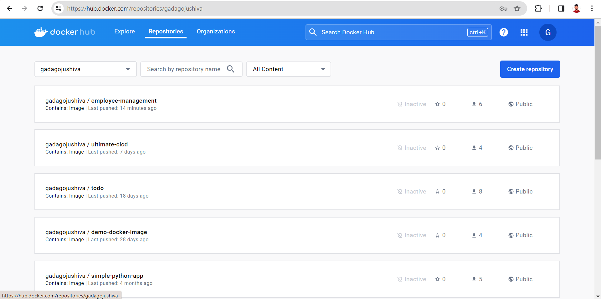

### Now Create an application in Argo CD using the UI
<li> Create application → name = "employee-management" → namespace = "default" → git repo = "https://github.com/gadagojushiva/employee-management-system" → path = "employee-management-manifest" → create

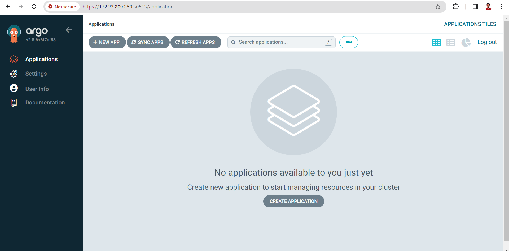

### Now check in Minikube
```bash
kubectl get pods
```
```bash
kubectl get svc
```
### Create a service for the application:
```bash
vim employee-management-service.yml
```
**Add the following to the YAML file:**

```yml
apiVersion: v1
kind: Service
metadata:
  name: employee-management-system
spec:
  type: NodePort
  ports:
  - name: http
    port: 80
    targetPort: 8080
    protocol: TCP
  selector:
    app: employee-management-system
```
**To Get the Services**
```bash
kubectl get svc
```
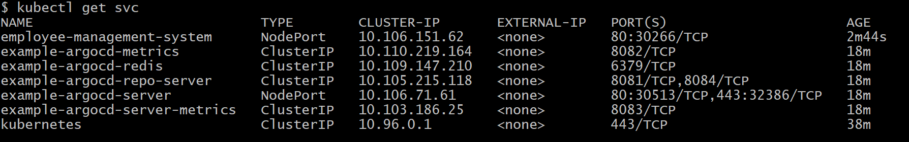
```bash
minikube service list
```

**Access the application at the provided URL.**

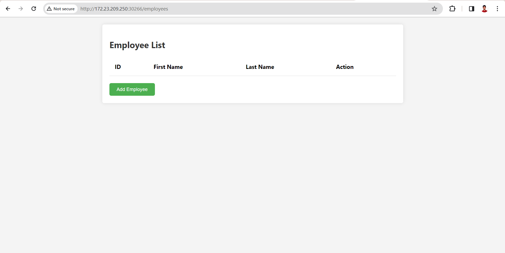


<p style="text-align: center; font-size: 36px; color: #2ecc71; font-weight: bold;">
    🎉 Congratulations! 🎉
</p>


## Extra Screenshots and CleanUp:

```bash
kubectl get pods
minikube delete
kubectl get pods
```
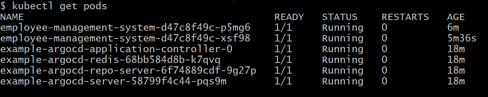

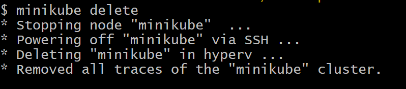


<p style="text-align: center; font-size: 24px; color: #3498db; font-weight: bold;">
    Successfully built an Employee Management System Spring Boot application using Maven and deployed it to Kubernetes using Argo CD!
</p>
